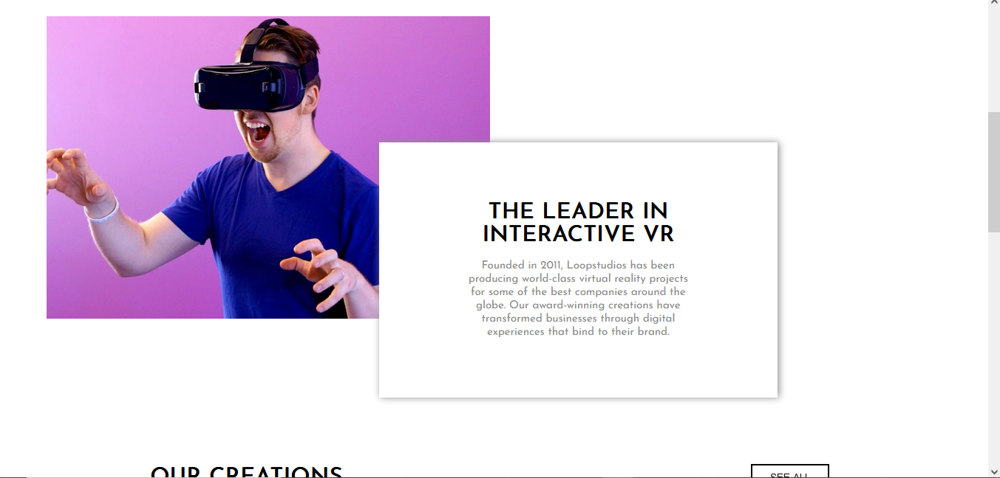

# Frontend Mentor - Loopstudios landing page solution

This is a solution to the [Loopstudios landing page challenge on Frontend Mentor](https://www.frontendmentor.io/challenges/loopstudios-landing-page-N88J5Onjw). Frontend Mentor challenges help you improve your coding skills by building realistic projects. 

## Table of contents

- [Frontend Mentor - Loopstudios landing page solution](#frontend-mentor---loopstudios-landing-page-solution)
  - [Table of contents](#table-of-contents)
  - [Overview](#overview)
    - [The challenge](#the-challenge)
    - [Screenshot](#screenshot)
    - [Links](#links)
  - [My process](#my-process)
    - [Built with](#built-with)
    - [What I learned](#what-i-learned)
    - [Continued development](#continued-development)
    - [Useful resources](#useful-resources)
  - [Author](#author)
## Overview

### The challenge

Users should be able to:

- View the optimal layout for the site depending on their device's screen size
- See hover states for all interactive elements on the page

### Screenshot
  Desktop💻🖥:



Mobile📱📱:


### Links

- Solution URL: [My solution](https://your-solution-url.com)
- Live Site URL: [My netlify site](hhttps://loopstudiomy.netlify.app/#)

## My process

### Built with

- Semantic HTML5 markup
- CSS custom properties
- Flexbox
- CSS Grid
- Mobile-first workflow
- [Vuejs with cli](https://vuejs.org/) - JS library

### What I learned

I learnt how to make a dropdown navigation which goes infront of everything, instead of just going under the navigation, and I got to practice my Vue Cli skills.

To see how you can add code snippets, see below:

```html
        <div class="dropdown container grid" ref="dropdown">
  
          <a class="logo" href="#">
          
        </a>
        
        <a class="header__icons" href="#" @click="toggleNav">
            
        </a>

          <nav class="dropdown__nav">
            <div class="container row">
              <ul class="nav__list">
                <li class="nav__item">
                  <a href="#" class="nav__link">
                    About
                  </a>
                </li>
                <li class="nav__item">
                  <a href="#" class="nav__link">
                    Careers
                  </a>
                </li>
                <li class="nav__item">
                  <a href="#" class="nav__link">
                    Events
                  </a>
                </li>
                <li class="nav__item">
                  <a href="#" class="nav__link">
                    Products
                  </a>
                </li>
                <li class="nav__item">
                  <a href="#" class="nav__link">
                    Support
                  </a>
                </li>
              </ul>
            </div>
          </nav>
      </div>
```
```css
@mixin backgroundIMG($Mobile, $Desktop) {
    background:url($Mobile) no-repeat;
    background-size:cover;
    @media screen and (min-width:800px) {
        background:url($Desktop) no-repeat;
     }
}

@mixin grid($auto, $min, $max) {
    display: grid;
    justify-items: center;
    grid-template-columns: repeat($auto, minmax($min, $max));
}
```
```js
toggleNav() {
      this.$refs.hamburger.classList.toggle('open');
      this.$refs.hamburger.classList.toggle('active');

      
      this.$refs.dropdownClose.classList.toggle('open');
      this.$refs.dropdownClose.classList.toggle('active');

      
      this.$refs.dropdown.classList.toggle('open');
      this.$refs.dropdown.classList.toggle('active');
    }
```

### Continued development

After this Im going to focus on improving my backend skills by going more deeper into python and learning the intermediate stuff so that I can use it more often in my projects.
### Useful resources

[cli.vuejs](https://cli.vuejs.org/guide/deployment.html) - This is an amazing article which helped me when I forgot how to do something in Vue or the Vue CLI. It's pretty helpful

## Author

- Website - [purplehippo911](https://purplehippo911.github.io/website/)
- Frontend Mentor - [@purplehippo911](https://www.frontendmentor.io/profile/purplehippo911)
- Discord - [mashedapples222#7574]